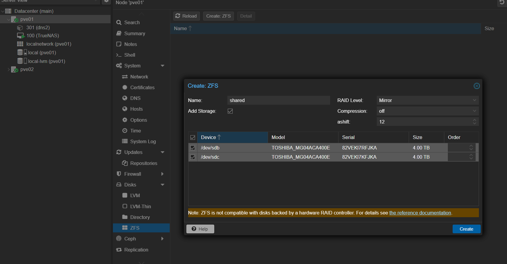

= ZFSの設定

== cf.
* https://zenn.dev/190ikp/articles/deploy_nfs_zfs_backend[ZFSストレージバックエンドのNFSサーバを立てる]

== 手順

=== ZFSプール作成

NOTE: ハードウェアRAIDカードがある場合はは無効化しておくこと.

. 物理ストレージが入ってるノードを選択して,
. `Disks.ZFS` を選択
. 上にある `Create: ZFS` から作れる. 名前を覚えておくこと.

.ZFSプールの作成

=== データセット作成

NFS用のデータセットを作成する。

[source, shell]
----
zfs create -o compression=lz4 shared/nfs
----

=== NFS Share

nfs-kernel-server をいれる

[source, shell]
----
apt update
apt install nfs-kernel-server
----

ZFSのdatasetをNFSでexportするようにする. 使えるoptionは `/etc/exports` で使えるものと同じ.footnote:[ここに載っている https://linux.die.net/man/5/nfs]

[source, shell]
----
sudo zfs set sharenfs="rw=@192.168.1.0/24,sync,no_subtree_check,no_root_squash" shared/nfs
----
